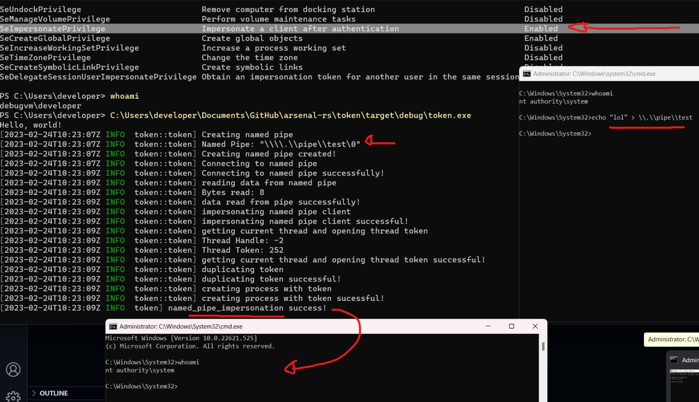

## Impersonate

A simple library that allows you to steal/make/impersonate tokens of a process and set/get token privileges.

## How token make/steal/impersonate token works

### Steal Token

The `steal_token()` function attempts to retrieve a duplicated access token associated with a process, given its process ID. If successful, it returns a handle to the duplicated token, otherwise it returns an error indicating the reason for failure.

1. Calls the `OpenProcess` function to retrieve a handle to an existing local process.
2. Calls the `OpenProcessToken` function to retrieve a handle to the access token associated with the process.
3. Calls the `DuplicateTokenEx` function to create a new access token that duplicates the original one.

### Make Token

The `make_token()` function attempts to authenticate a user with a given `domain`, `username`, and `password` by calling the `LogonUserW` function. If successful, it returns a handle to a token that represents the logged-on user, which can be used to impersonate the specified user or create a process that runs in the context of the specified user.

1. Calls the `LogonUserW` to log the user onto the local computer. If the logon is successful, the function returns the token handle.

### Impersonate Token

This `impersonate_token` function allows the calling thread to impersonate the security context of a logged-on user, represented by a token handle. This can be useful for performing actions on behalf of another user, such as accessing files or resources that are only available to that user.

1. Calls the `ImpersonateLoggedOnUser` function which allows the calling thread to temporarily take on the security context of the logged-on user. If the function call is successful, it returns the token handle

### Set Token Privileges

The `set_token_privileges` function takes a privilege name and a boolean value to either enable or disable that privilege in the current process's access token. It first looks up the locally unique identifier (`LUID`) for the specified privilege name using the `LookupPrivilegeValueW` function. Then, it constructs a `TOKEN_PRIVILEGES` structure with the `LUID` and the desired attributes (enabled or disabled). The function then opens the process's access token using the `OpenProcessToken` function and calls the `AdjustTokenPrivileges` function to adjust the privileges in the token.

1. Calls the `LookupPrivilegeValueW` function to look up the locally unique identifier (`LUID`) for the specified privilege name
2. Constructs a `TOKEN_PRIVILEGES` structure with the `LUID`
3. Calls `OpenProcessToken` to opens the process's access token
4. Calls the `AdjustTokenPrivileges` function to adjust the privileges in the token.

### Get Token Privileges (TODO)


### Named Pipe Token Impersonation

Windows operating systems use Pipe Token Impersonation to let a process execute in the security context of a different user. It requires passing security tokens back and forth between processes through a named pipe, which is Windows' method for interprocess communication.

With the security token linked to the client process, the server process can mimic the client process when a client process connects to it over a named pipe. This implies that the server process does not need the same level of permissions as the client process to access resources that are only accessible to the client process, such as files or network resources.


This `impersonate_named_pipe` creates a named pipe with a specified name, waits for a client to connect, reads data from the client through the pipe, impersonates the client by duplicating its security token, and uses the duplicated token to create a new process with elevated privileges. The process it creates with elevated privileges is a new cmd.exe command shell program instance.


1.  `CreateNamedPipeA`: Creates an instance of a named pipe and returns a handle for subsequent pipe operations.
2.  `ConnectNamedPipe`: Enables a named pipe server process to wait for a client process to connect to an instance of a named pipe.
3.  `ImpersonateNamedPipeClient`: Impersonates a named pipe client application.
4.  `OpenThreadToken()`: Opens the access token associated with a thread.
5.  `DuplicateTokenEx`: Creates a new access token that duplicates an existing token.
6.  `CreateProcessWithTokenW`: Creates a new process and its primary thread using the specified token.

Create a named pipe, wait for the client process to connect to an instance of a named pipe. Please note, you MUST have the `SeImpersonatePrivilege` privilege, which is usually enabled as a administrator in a high integrity context.
```
C:\Users\memN0ps\Documents\GitHub\arsenal-rs\token\target\debug\token.exe
```

Run the following as `NT AUTHORITY\SYSTEM` to connect to an instance of the named pipe or coerce a target to connect to you.
```
echo "lol" > \\.\pipe\test
```

You should now see a new SYSTEM shell. (PoC done).




## Usage Example

```rust
mod process;
mod token;
use crate::token::{make_token, set_token_privileges, steal_token};
use token::{impersonate_named_pipe, impersonate_token, revert_to_self};
use windows_sys::Win32::System::SystemServices::{
    SE_ASSIGNPRIMARYTOKEN_NAME, SE_DEBUG_NAME, SE_IMPERSONATE_NAME,
};
mod privileges;

fn main() {
    env_logger::init();

    match named_pipe_impersonation() {
        Ok(_) => log::info!("named_pipe_impersonation success!"),
        Err(e) => log::error!("Error: named_pipe_impersonation failed {:?}", e),
    }

    match token_magic_test() {
        Ok(_) => log::info!("token_magic_test success!"),
        Err(e) => log::error!("Error: token_magic_test failed {:?}", e),
    }

    match process_magic_test() {
        Ok(_) => log::info!("process_magic_test success!"),
        Err(e) => log::error!("Error: process_magic_test failed {:?}", e),
    }
}

pub fn token_magic_test() -> Result<(), token::error::Error> {
    set_token_privileges(SE_DEBUG_NAME, true)?;
    set_token_privileges(SE_ASSIGNPRIMARYTOKEN_NAME, true)?;

    let duplicate_token = steal_token(10608)?;
    log::info!("{}", duplicate_token);
    impersonate_token(duplicate_token)?;
    revert_to_self()?;

    let token = make_token("north.sevenkingdoms.local", "robb.stark", "sexywolfy")?;
    log::info!("{}", token);
    impersonate_token(token)?;
    revert_to_self()?;

    Ok(())
}

pub fn process_magic_test() -> Result<(), process::error::Error> {
    let process_id = process::get_process_id_by_name("notepad.exe")?;
    let module_id = process::get_module_address_by_name("kernel32.dll", process_id)?;

    log::info!("process_id: {}", process_id);
    log::info!("Module ID: {:x}", module_id);

    Ok(())
}

pub fn named_pipe_impersonation() -> Result<(), token::error::Error> {
    //set_token_privileges(SE_IMPERSONATE_NAME, true)?;
    impersonate_named_pipe("test")?;
    Ok(())
}
```

## Credits / References

* [C5pider](https://twitter.com/C5pider): https://github.com/HavocFramework/Havoc
* [zblurx](https://twitter.com/_zblurx): https://github.com/zblurx/impersonate-rs (This is similar but does not have named pipe impersonation or make_token functionality. It's also a binary and not a library).
* This project was dedicated to [@_RastaMouse](https://twitter.com/_RastaMouse)
* https://book.hacktricks.xyz/windows-hardening/windows-local-privilege-escalation/named-pipe-client-impersonation
* https://github.com/rapid7/metasploit-payloads/blob/master/c/meterpreter/source/extensions/priv/namedpipe.c